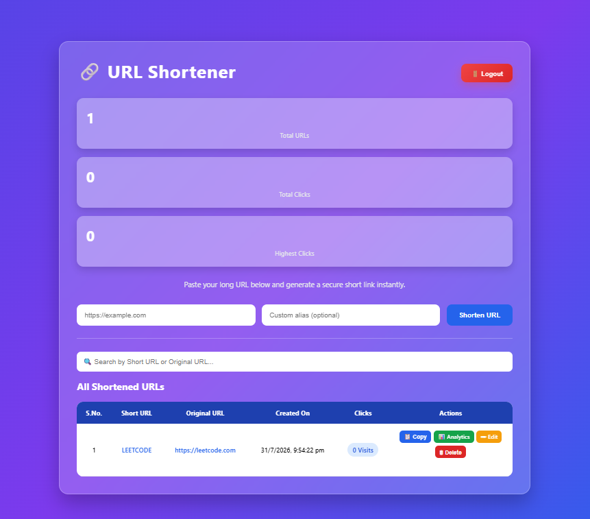
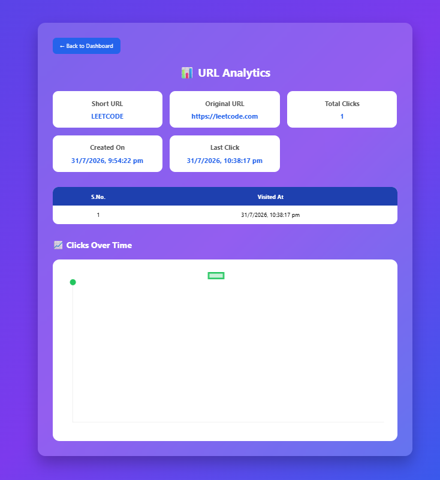

# 🔗 URL Shortener

A secure and modern URL Shortener built using **Node.js**, **Express.js**, **MongoDB**, **JWT Authentication**, **EJS**, and **Chart.js**.

The application allows users to create short URLs, manage them through a dashboard, and analyze click statistics with interactive graphs.

---

## 🚀 Features

### Authentication

- User Signup
- User Login
- JWT Authentication
- Secure Password Hashing using bcrypt
- Logout

### URL Management

- Generate Short URLs
- Custom Short URLs (Aliases)
- Edit Original URL
- Delete URL
- Copy Short URL with one click
- Search URLs
- Responsive Dashboard

### Analytics

- Total Click Count
- Last Click Timestamp
- Complete Click History
- Click Analytics Graph (Chart.js)

### UI

- Modern Glassmorphism Design
- Responsive Layout
- Empty State Handling
- Beautiful Dashboard

---

## 🛠 Tech Stack

### Frontend

- HTML
- CSS
- EJS
- JavaScript

### Backend

- Node.js
- Express.js

### Database

- MongoDB
- Mongoose

### Authentication

- JWT
- bcrypt

### Charts

- Chart.js

---

## 📁 Project Structure

```
controllers/
middlewares/
models/
routes/
service/
views/

index.js
connection.js
package.json
```

---

## ⚙️ Installation

Clone the repository

```bash
git clone https://github.com/sandeepdeveloper247-rgb/URL-Shortener.git
```

Move inside the project

```bash
cd URL-Shortener
```

Install dependencies

```bash
npm install
```

Create a `.env` file

```env
PORT=8003
MONGO_URI=your_mongodb_connection_string
JWT_SECRET=your_secret_key
```

Run the application

```bash
npm start
```

---

## 📸 Screenshots

### Login


---

### Signup


---

### Dashboard



---

### Analytics



---

## 🌱 Future Improvements

- QR Code Generation
- URL Expiration
- Password Protected URLs
- Download Analytics as CSV
- User Profile Page

---

## 👨‍💻 Author

**Sandeep Pradhan**

GitHub:
https://github.com/sandeepdeveloper247-rgb
